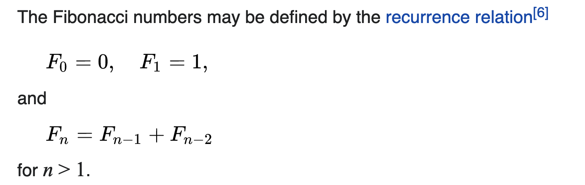
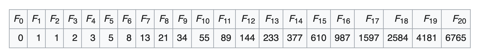

# Aufgabe 5 (8 Punkte)

## Vorgehen
Definieren Sie das Interface `IntSequence`. Die Signaturen können Sie aus den Testfällen ableiten. Implementieren Sie die Klasse `FibonacciSequence`, welche dieses Interface implementiert. Die Fibonacci-Folge ist unendlich. Unsere Klasse bricht die Fibonacci-Folge nach 41 Folgegliedern ab. Achtung: Die Folge hat ein 0. Folgeglied, `F0`, siehe unten.

Es folgt die Definition der Fibonacci-Zahlen:

Das sind die ersten 20 Fibonacci-Zahlen:

## Hinweis
Entfernen Sie schrittweise die Zeilenkommentare der Tests. Beginnen Sie mit dem ersten Test, wenn dieser erfolgreich durchläuft, entfernen Sie den Kommentar des zweiten Tests usw. 